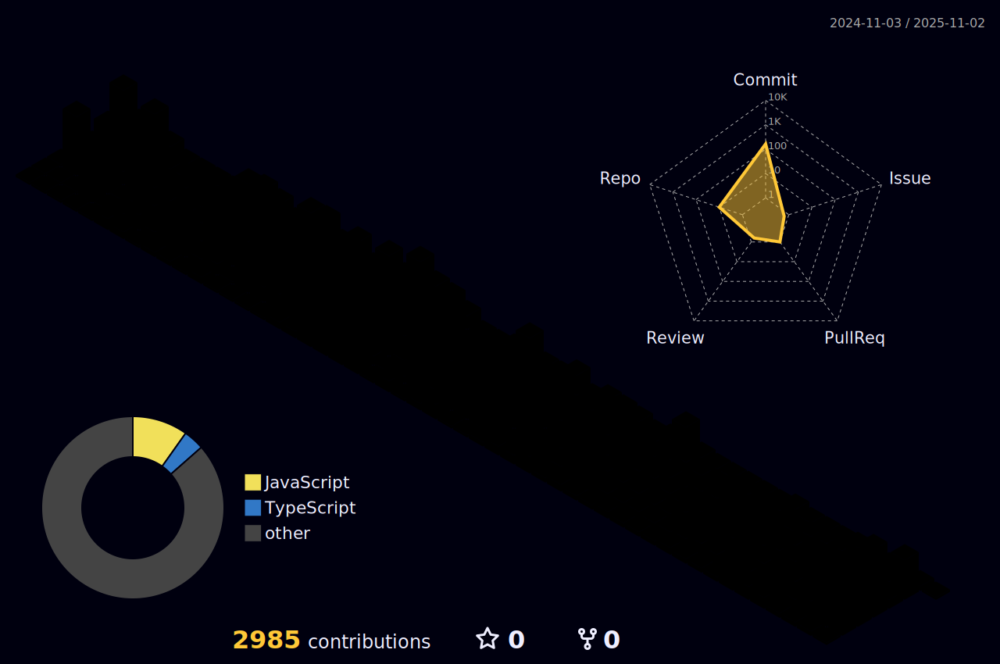

  

  
   ## 🧱 Tech Stack
  ### Language
  <!--Python-->
  
  <!--JavaScript-->
  
  <!--TypeScript-->
  
  <!--HTML5-->
  
  <!--CSS-->
  
   
  
  ### Library
   
  
  ### Framework
  <!--React-->
  
  <!--Next-->
  
   

  

